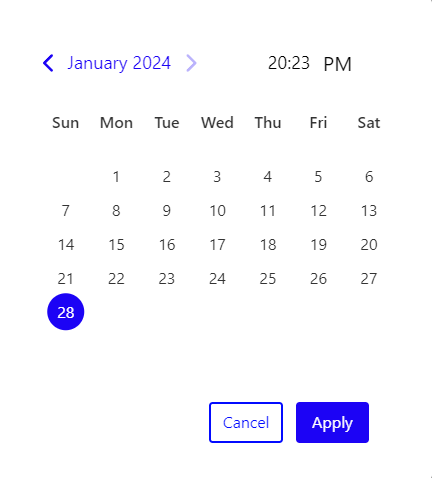

# React DateTime Range Input

[](https://www.npmjs.com/package/react-datetimerangeinput)
[](https://opensource.org/licenses/MIT)
[](https://www.npmjs.com/package/react-datetimerangeinput)

A customizable and user-friendly React component for selecting date and time ranges.

## Features

- **Flexible Date and Time Range Selection**: Allow users to easily select both start and end dates along with specific time ranges.
- **Customizable Appearance**: Tailor the appearance of the input to match your application's design.
- **Responsive Design**: Ensure a seamless user experience across various screen sizes and devices.
- **Easy Integration**: Quickly integrate the component into your React projects.

## Consider native alternative

If you don't need to support legacy browsers and don't need the advanced features this package provides, consider using native datetime input instead. It's more accessible, adds no extra weight to your bundle, and works better on mobile devices.

```tsx
<input aria-label="Date and time from" max={valueTo} min={minDatetime} type="datetime-local" />
<input aria-label="Date and time to" max={maxDatetime} min={valueFrom} type="datetime-local" />
```

## Looking for a time picker or a datetimerange picker?

React-DateTimeRange-Picker will play nicely with [React-Date-Picker](https://github.com/Edukondalu71/React_DateTime_RangeInput). Check them out!

## Getting started

Here's an example of basic usage:

## Installation

Install the package using npm:

```bash
  npm i react-datetimerangeinput
```


```javascript
  import DateTimeRangeInput from 'react-datetimerangeinput';
  function App() {
    const [dateRange, setDateRange] = useState({startDate: new Date(), endDate: new Date()});
    const updateDateRange = (key:string, value:object) => {
    setDateRange((prevDateRange:object) => ({
      ...prevDateRange,
     [key] : value
    }));
  }
  return (
    <div className="App">
      <div className='inputDivContainer'>
        <DateTimeRangeInput
          dateRangeValue={dateRange}
          callBackDateRange={updateDateRange}
          styles={{
            display: 'flex',
            flexDirection: 'row',
            justifyContent: 'center'
          }}
          inputStyle={{ 
            border: '2px solid #000000', 
            width: '600px' 
          }}
        />
      </div>
    </div>
  );
}
export default App;
```

This is a sample image:

;

### Custom styling


